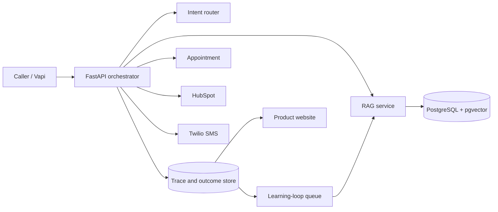

# CallFlow Recovery

**A complete forward-deployed vertical slice:** caller intent → approved knowledge → appointment → CRM → SMS → persisted outcome.

**Live app:** [https://callflow-recovery.onrender.com/](https://callflow-recovery.onrender.com/)

[](https://render.com/deploy?repo=https://github.com/raamnandhakumar-eng/callflow-recovery)

CallFlow Recovery is a production-style reference deployment for a service business that believes it is "losing calls." The build treats the real problem as a chain of business-state changes, not as a conversational demo.

## Product website

The repository includes a complete product interface, not only backend endpoints:

- public product landing page at `/`;
- interactive scenario runner for appointment, pricing, emergency, and knowledge-gap calls;
- revenue recovery dashboard with persisted booking, cost, latency, CRM, and SMS metrics;
- expandable call traces with transcripts, grounding citations, and workflow steps;
- human approval interface for unresolved questions;
- deployment status for voice, CRM, messaging, LLM, and database adapters.

The browser scenario runner calls the same orchestration service used by the Vapi webhook, so the website is an operational interface over the real vertical slice rather than a static mockup.

## Deploy publicly on Render

The root-level [`render.yaml`](render.yaml) is a one-click Blueprint that provisions:

- the Docker-based FastAPI web service;
- a private Render PostgreSQL database;
- automatic demo-tenant and knowledge-base seeding;
- `/health` monitoring;
- automatic deployment after GitHub CI checks pass;
- a generated Vapi webhook secret.

Click the **Deploy to Render** button above, sign in to Render, review the two resources, and approve the Blueprint. The product runs in deterministic mock mode immediately, so OpenAI, HubSpot, Twilio, and Vapi credentials can be connected later from the Render environment settings.

After deployment, open the generated `onrender.com` URL. The product website is at `/`, the operations console is at `/dashboard/northstar-hvac`, and the API documentation is at `/docs`.

## Working path

1. Receive a real Vapi webhook or a synthetic call.
2. Route intent with a fast local classifier.
3. Retrieve tenant-approved knowledge from PostgreSQL and pgvector.
4. Produce a concise grounded answer with citations.
5. Create an appointment before claiming success.
6. Upsert the customer in HubSpot, or use the deterministic mock adapter.
7. Send a Twilio SMS confirmation, or use the deterministic mock adapter.
8. Persist the full trace, cost, latency, and final outcome.
9. Surface unresolved questions for human approval.
10. Turn approved answers into knowledge and regression cases.

## Why this is not a chatbot demo

- A booking is successful only when the appointment row exists.
- Replayed webhooks return the original result and do not duplicate downstream actions.
- Unsupported requests escalate instead of receiving fabricated answers.
- Metrics come from persisted traces and integration records.
- The dashboard reports booking conversion, p95 latency, cost per booking, CRM/SMS completion, and estimated recovered revenue.

## Architecture



## Run locally with SQLite and mock integrations

```bash
python -m venv .venv
source .venv/bin/activate
pip install -e '.[dev]'
cp .env.example .env
python scripts/seed.py
uvicorn app.main:app --reload
```

Open:

- Product website: `http://localhost:8000/`
- Operations dashboard: `http://localhost:8000/dashboard/northstar-hvac`
- API docs: `http://localhost:8000/docs`

The dashboard can run the end-to-end scenarios directly. You can also use the command-line runner:

```bash
python scripts/run_scenarios.py --replay
```

## Run with PostgreSQL and pgvector

```bash
cp .env.example .env
docker compose up --build
```

The Compose deployment uses `pgvector/pgvector:pg16` and automatically seeds two tenants.

## Connect real infrastructure

### Vapi

Create the custom function from `config/vapi-tool.json`, attach its ID using `config/vapi-assistant.json`, and configure a secured server credential. The Vapi adapter accepts `tool-calls` events and returns results keyed by `toolCallId`. The synthetic runner and browser scenario runner exercise the same orchestration service used by the voice adapter.

### HubSpot

Set `HUBSPOT_ACCESS_TOKEN`. Without it, the system uses a deterministic mock CRM ID. The live adapter searches by phone before create/update, while the local workflow record protects replay idempotency.

### Twilio

Set `TWILIO_ACCOUNT_SID`, `TWILIO_AUTH_TOKEN`, and `TWILIO_FROM_NUMBER`. Without them, the system records a deterministic mock message SID.

### OpenAI

Set `OPENAI_API_KEY` to use a live model for grounded answer generation. Without it, a deterministic generator keeps tests and demos reproducible. Token and cost fields are persisted in either mode.

## Synthetic scenarios

The runner includes:

- appointment booking;
- price question;
- after-hours emergency;
- unresolved knowledge gap;
- optional replay of the booking call to prove idempotency.

```bash
python scripts/run_scenarios.py --base-url http://localhost:8000 --replay
```

## Learning loop

An unsupported call creates a clustered FAQ suggestion. Approving it from the dashboard or API:

- creates an approved knowledge document;
- marks the suggestion approved;
- creates a regression case;
- allows the next matching call to answer from the new source.

This is intentionally human-gated. The system does not silently promote model-generated content into customer-facing knowledge.

## Tests

```bash
ruff check .
pytest --cov=app --cov-report=term-missing
```

The integration tests prove the complete mocked vertical slice, grounded retrieval, idempotent replay, persisted metrics, learning-loop approval, product website routes, and Render database URL compatibility.

## Production evidence to collect next

The repository is runnable without paid infrastructure, but the portfolio claim becomes materially stronger after these real steps:

1. deploy the product website to a public HTTPS endpoint;
2. connect a Vapi or Retell number;
3. place and record real calls;
4. connect a HubSpot sandbox;
5. send a real Twilio confirmation;
6. record p50/p95 latency and cost per booking;
7. replace `docs/incident-report.md` with a genuine incident from the live deployment.

Do not describe the project as a customer production deployment until a real external user depends on it.

## Documentation

- [`docs/discovery-notes.md`](docs/discovery-notes.md)
- [`docs/architecture.md`](docs/architecture.md)
- [`docs/integration-playbook.md`](docs/integration-playbook.md)
- [`docs/cost-playbook.md`](docs/cost-playbook.md)
- [`docs/incident-report.md`](docs/incident-report.md)
- [`docs/live-deployment-checklist.md`](docs/live-deployment-checklist.md)
- [`BUILD_STATUS.md`](BUILD_STATUS.md)
