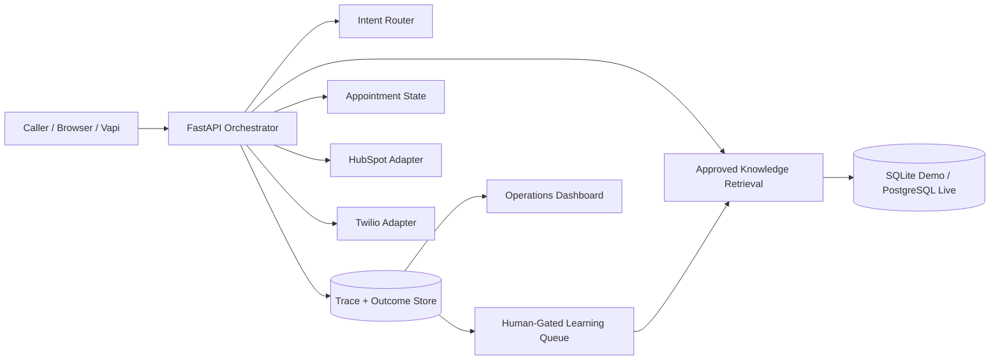

# CallFlow Recovery

**Production-style AI workflow:** caller intent → approved knowledge → appointment → CRM/SMS adapter → persisted outcome.

**Interactive app:** [https://callflow-recovery.onrender.com/](https://callflow-recovery.onrender.com/)

CallFlow Recovery is an inspectable vertical slice for service businesses that lose inbound demand. It is built around business-state changes rather than a chat transcript alone.

## Start here

No account is required.

1. Open the interactive app.
2. Select **Appointment booking**.
3. Click **Run end-to-end call**.
4. Review the result, then click **Refresh and inspect trace**.
5. Try the pricing, emergency, and knowledge-gap paths.
6. Open `/ready` to see which integrations are live versus simulated.

The public deployment runs in explicit demo mode. Appointment records, retrieval, escalation, idempotency, traces, metrics, and the learning loop execute normally. If HubSpot or Twilio credentials are not connected, their adapter actions are clearly labeled simulated rather than presented as real external sends.

## What the product demonstrates

- Intent classification for appointment, FAQ, emergency, reschedule, and unsupported requests
- Retrieval from tenant-approved knowledge with stored citations
- Appointment creation before the system claims a booking succeeded
- HubSpot CRM adapter with idempotent create/update behavior
- Twilio SMS adapter with idempotent confirmation handling
- Human escalation when evidence or workflow support is insufficient
- Persisted call outcome, latency, model cost, citations, and execution steps
- Human-approved learning loop for unresolved questions
- Replay protection across appointment, CRM, and SMS state changes
- Deployment-readiness reporting through `/ready`

## Demo mode versus live mode

### Public demo

`DEMO_MODE=true`

The public demo is self-contained and usable without private credentials:

- CRM produces deterministic `demo-*` IDs when HubSpot is not connected.
- SMS produces deterministic `demo-*` IDs and `simulated` status when Twilio is not connected.
- The UI explicitly says when CRM/SMS actions were simulated.
- The deterministic answer generator keeps the demo usable when no OpenAI API key exists.
- The Render demo uses SQLite storage under `/tmp` and reseeds the demo tenant when the service restarts.

This mode proves orchestration, business-state handling, observability, idempotency, and the integration contracts. It does **not** claim that a simulated CRM/SMS action reached an external provider.

### Strict live mode

`DEMO_MODE=false`

Strict mode fails closed when required downstream credentials are missing. It does not silently replace a missing HubSpot or Twilio integration with a successful-looking demo action.

For a live deployment, configure:

- durable PostgreSQL storage;
- Vapi or another supported voice provider;
- `HUBSPOT_ACCESS_TOKEN`;
- `TWILIO_ACCOUNT_SID`;
- `TWILIO_AUTH_TOKEN`;
- `TWILIO_FROM_NUMBER`;
- optionally `OPENAI_API_KEY`.

## Execution path

1. Receive a Vapi tool call or browser scenario request.
2. Route the caller intent.
3. Retrieve relevant approved knowledge.
4. Generate a grounded response and store citations.
5. Create the appointment before claiming booking success.
6. Execute the CRM adapter.
7. Execute the SMS adapter.
8. Persist the outcome and full execution trace.
9. Escalate unsupported or high-risk requests.
10. Route unresolved questions into a human-approved learning loop.

## Why this is more than a chatbot demo

- A booking is backed by an appointment record.
- Replayed requests do not duplicate appointment, CRM, or SMS records.
- Unsupported requests escalate instead of receiving fabricated answers.
- Downstream adapter state is persisted and inspectable.
- Demo integrations are explicitly identified as simulated.
- Strict mode rejects missing production integrations.
- Metrics are calculated from persisted workflow records.

## Architecture



## Public deployment

The root `render.yaml` deploys the Docker-based FastAPI app with:

- automatic deployment from repository commits;
- `/health` monitoring;
- explicit `APP_ENV=demo` and `DEMO_MODE=true`;
- SQLite demo storage;
- automatic demo-tenant and approved-knowledge seeding;
- a generated Vapi webhook secret.

The public deployment favors a reliable, credential-free demo experience. For customer production usage, replace the demo database with durable PostgreSQL and connect the external providers listed above.

## Run locally

```bash
python -m venv .venv
source .venv/bin/activate
pip install -e '.[dev]'
cp .env.example .env
python scripts/seed.py
uvicorn app.main:app --reload
```

Open:

- Product site: `http://localhost:8000/`
- Dashboard: `http://localhost:8000/dashboard/northstar-hvac`
- Readiness: `http://localhost:8000/ready`
- API docs: `http://localhost:8000/docs`

## PostgreSQL development stack

```bash
cp .env.example .env
docker compose up --build
```

The Compose stack uses `pgvector/pgvector:pg16` for PostgreSQL development.

## Integration notes

### Vapi

The webhook endpoint accepts Vapi `tool-calls` events and returns responses keyed by `toolCallId`. Configuration examples live in `config/vapi-tool.json` and `config/vapi-assistant.json`.

### HubSpot

With `HUBSPOT_ACCESS_TOKEN`, the CRM adapter searches by phone before create/update. Local workflow records protect replay idempotency. Without the token, only explicit demo mode may use the simulated adapter.

### Twilio

With the full Twilio credential set, the SMS adapter sends through Twilio. Without those credentials, only explicit demo mode may produce a simulated SMS result.

### OpenAI

With `OPENAI_API_KEY`, the answer generator can use the configured model. Without it, deterministic generation keeps the demo and tests reproducible.

## Automated verification

```bash
ruff check .
pytest --cov=app --cov-report=term-missing
```

Current GitHub Actions result:

- **13 tests passing**
- **87% application coverage**
- Ruff lint checks passing

The suite covers the end-to-end booking path, grounded FAQ responses, escalation, learning-loop approval, Vapi adapter contract, idempotent replay, persisted metrics, public website routes, demo readiness, and fail-closed CRM/SMS behavior outside demo mode.

## Claims boundary

This repository supports the claim **production-style AI workflow**. It does not yet support a claim of customer production deployment. Do not describe simulated CRM/SMS actions as real external sends, and do not claim customer production usage or realized recovered revenue without evidence from connected infrastructure.

## Documentation

- [`BUILD_STATUS.md`](BUILD_STATUS.md)
- [`docs/architecture.md`](docs/architecture.md)
- [`docs/integration-playbook.md`](docs/integration-playbook.md)
- [`docs/live-deployment-checklist.md`](docs/live-deployment-checklist.md)
- [`docs/cost-playbook.md`](docs/cost-playbook.md)
- [`docs/discovery-notes.md`](docs/discovery-notes.md)
