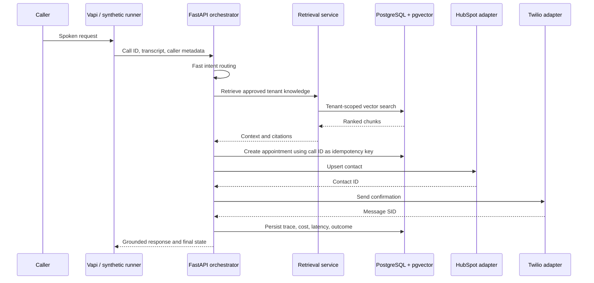

# Architecture

## Production boundaries

- `external_call_id` is the workflow idempotency key.
- Every persistent table includes `tenant_id`.
- The agent cannot claim success before the appointment row exists.
- CRM and SMS operations check local idempotency records before external calls.
- Unsupported questions create a learning-loop suggestion instead of a fabricated answer.
- The dashboard reads persisted outcomes, not model self-reports.

## Retrieval

PostgreSQL deployments use the `pgvector/pgvector:pg16` image and a tenant-scoped `kb_chunks` table. SQLite test environments use the same chunking contract with deterministic local embeddings and lexical scoring.
